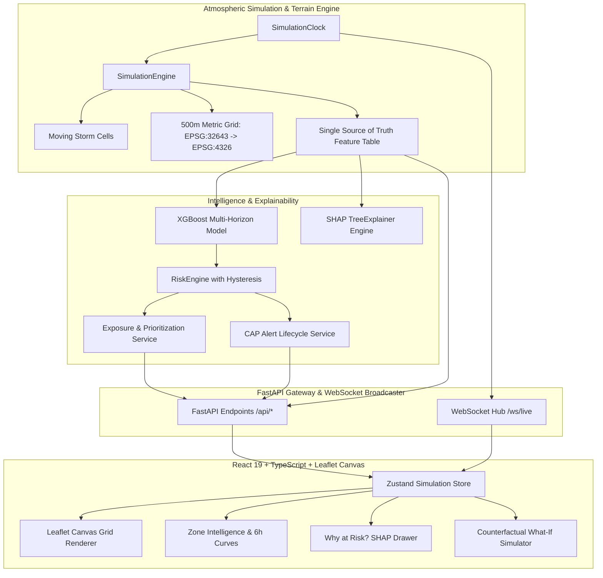

# FloodShield — Urban Flood Early Warning System (Delhi NCR)

> **Simulation Disclaimer**: FloodShield Milestone 1 is a research prototype operating on deterministic simulated atmospheric and hydrological data. Every screen, API response, and alert contains explicit simulation markers. It does not issue official warnings. For real emergencies, refer to the India Meteorological Department (IMD) and Delhi Disaster Management Authority (DDMA).

---

## System Overview

FloodShield predicts urban flood likelihood across Delhi NCR at a 500-meter grid resolution 1 to 6 hours in advance. It integrates:
- **Atmospheric Scenarios**: Moving storm cells with spatial Gaussian falloff and temporal growth/decay curves.
- **Topography & Hydrology**: High ground along the Aravalli ridge, Yamuna floodplain depressions, and Najafgarh drain basins.
- **Physical Runoff & Infiltration**: Manning-based drainage evacuation, impervious surface ratios, and Height Above Nearest Drainage (HAND).
- **Machine Learning**: Multi-horizon XGBoost classifier trained on synthetic scenario records (`trained_on: synthetic`).
- **Explainable AI (XAI)**: Real SHAP `TreeExplainer` providing local feature attributions and plain-language summaries.
- **Impact-Based Prioritization**: Ranking zones by `Hazard × Exposure × Vulnerability`.
- **Early Warnings**: Common Alerting Protocol (CAP-v1.2) compliant alert state machine with hysteresis, cooldowns, and operator audit trail.
- **Interactive Operations GIS**: Leaflet Canvas map (14 layers) with 60fps pan/zoom, What-If simulator, and live WebSocket feed.

---

## Architecture Diagram



---

## Quickstart

### Prerequisites
- Python 3.11+
- Node.js 18+ and npm

### 1. Backend Setup & Startup
```bash
# Install dependencies
pip install -r requirements.txt

# Start backend server (runs on port 8000)
python -m uvicorn backend.app.main:app --host 127.0.0.1 --port 8000
```
Interactive API documentation is available at `http://127.0.0.1:8000/docs`.

### 2. Frontend Setup & Startup
```bash
cd frontend
npm install
npm run dev
```
Open `http://localhost:5173/` in your browser.

### 3. Run Automated Tests
```bash
# Run backend test suite
pytest backend/tests

# Build frontend bundle
cd frontend && npm run build
```

---

## Core API Endpoints

- `GET  /api/health` — Service health and simulation status
- `GET  /api/zones` — Static 500m GeoJSON polygons (EPSG:4326)
- `GET  /api/flood-map` — Compact dynamic probability & risk values
- `GET  /api/predictions/{zone_id}` — Comprehensive Zone Intelligence
- `GET  /api/priorities?top=10` — Hazard × Exposure prioritized ranking
- `GET  /api/explanations/{zone_id}` — Real SHAP TreeExplainer attributions
- `POST /api/whatif` — Counterfactual rainfall & blockage simulation
- `GET  /api/alerts` — Active early warning feed
- `POST /api/alerts/test` — Test alert injector
- `WS   /ws/live` — Real-time simulation state & weather broadcast
